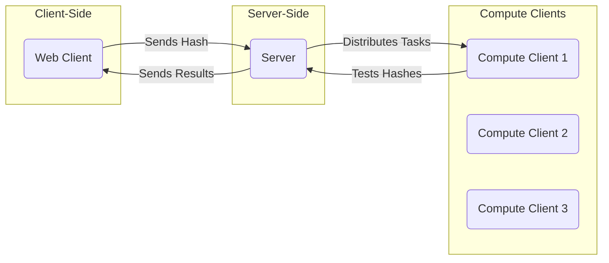

# TODO

(Add yourself to bulletpoint if you are working on it)

- Create web client (HTML/CSS/JS) that will:
    - prompt only for letters & numbers
    - will display hash for that password
    - send users input passwords to the server with IPC sockets
    - away display server response of possibly 

(Working on ^ - Khalid)

- Create server client (C++) that will:
    - receive hash from web client with IPC sockets
    - communicate with compute clients using TCP
    more

# Overview

